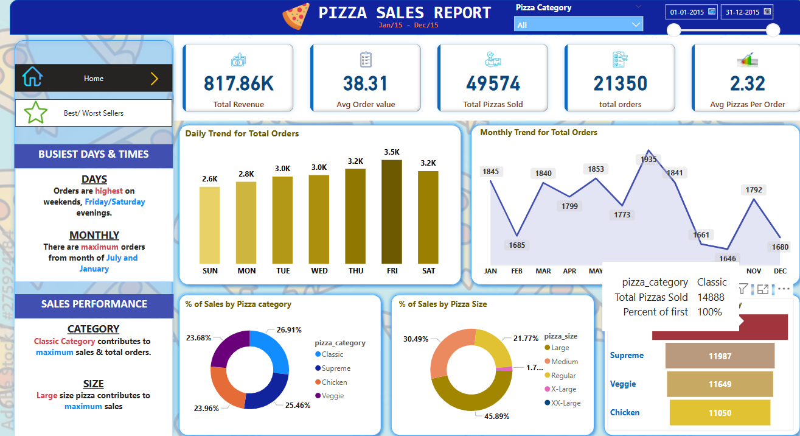

# 🍕 Pizza Sales Report - Power BI

This project presents an interactive **Pizza Sales Dashboard** developed using **Power BI**. It provides meaningful insights into pizza sales performance to help businesses make data-driven decisions.

---

## 📊 Overview

The Pizza Sales Report analyzes historical sales data from a pizza restaurant. It includes various KPIs, trends, and visualizations that allow stakeholders to monitor performance, understand customer preferences, and optimize operations.

---

## 📁 Dataset

- **Source**:  Kaggle
- **Contents**:
  - Order ID
  - Order Date & Time
  - Pizza Type & Size
  - Quantity Sold
  - Price
  - Total Revenue

---

## 🔍 Key Insights

- 📅 **Sales by Date/Month**  
- 🕒 **Peak Order Times**  
- 🍕 **Top-Selling Pizzas**  
- 📏 **Sales by Pizza Size**  
- 💵 **Total Revenue Trends**  
- 📦 **Order Volume per Day**  
- 🧾 **Average Order Value**

---

## 🛠 Tools & Technologies

- **Power BI** – For dashboard creation and data visualization  
- **Excel / CSV** – Data pre-processing  
- **DAX (Data Analysis Expressions)** – For calculated columns and measures

---

## 📌 Features

- Interactive slicers for date, pizza type, and size  
- Drill-through for order-level details  
- Trend lines to identify seasonal patterns  
- KPIs highlighting revenue and order metrics

---

## 🧠 Learnings

- Built efficient DAX measures for performance  
- Enhanced data storytelling using filters and cards  
- Applied best practices in Power BI design for clarity and usability

---

## 📷 Dashboard Preview

## 📷 Dashboard Preview

---

## 🚀 Getting Started

1. Clone this repository  
2. Open the `.pbix` file using Power BI Desktop  
3. Load the dataset (if not embedded)  
4. Explore and interact with the report
